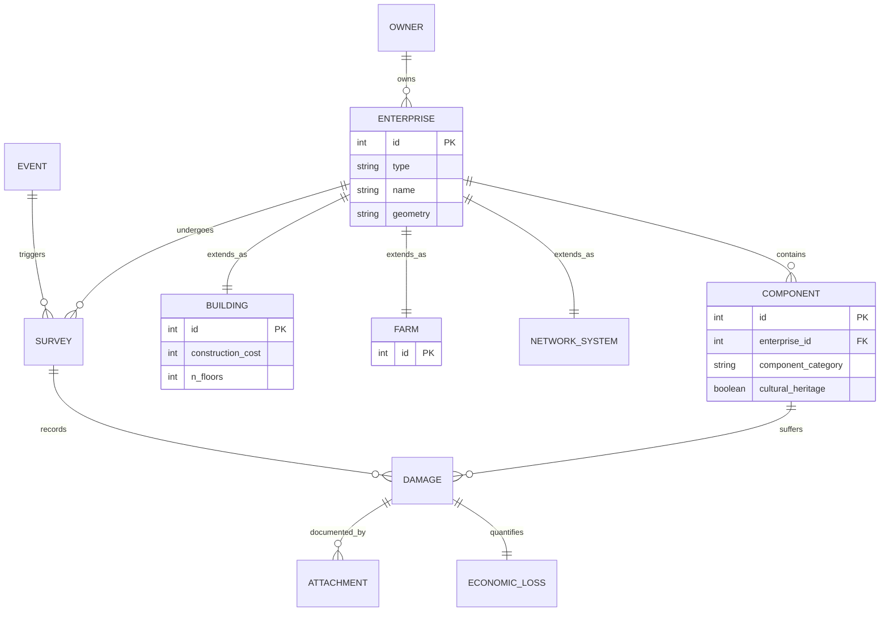

# Schema overview

This diagram illustrates the core entities of our database and how they relate to one another. It highlights the main architecture, including ownership, physical components, and the recording of damage events.

### Relationship Legend
* `||--o{` : **One-to-Many**. *Example: An enterprise contains many components.*
* `||--||` : **One-to-One**. *Example: The Building record is a direct extension of an Enterprise record.*
* `}o--||` : **Many-to-One**. *Example: Many enterprises can belong to a single owner.*