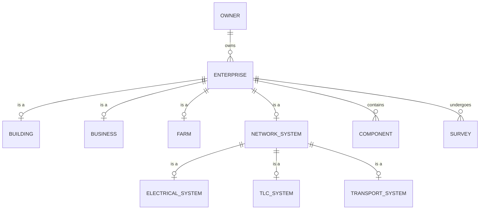
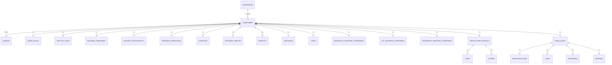
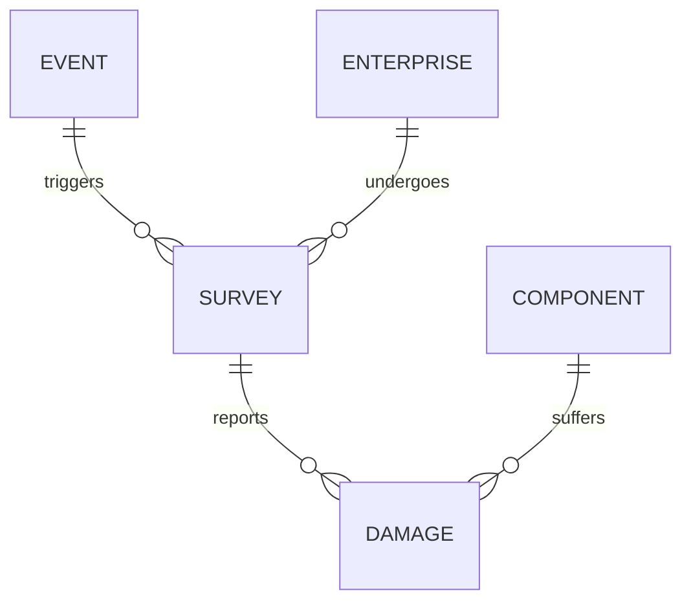

# Schema overview

The `public` schema is organised around three groups of tables:

1. **Enterprises**: the owned, located units that can be damaged (buildings, farms, businesses, network systems).
2. **Components**: the physical or economic elements that belong to an enterprise (crops, machinery, staff, road segments, and so on).
3. **Assessment**: events, surveys and the damage records they produce.

Enterprises and components both use **table-per-subtype inheritance**: a sub-type table shares the primary key of its parent, so a row is joined to its parent with `child.id = parent.id`.

The schema is shown in three diagrams to keep each one readable.

## 1. Enterprises and ownership

```mermaid
erDiagram
    OWNER ||--o{ ENTERPRISE : owns
    ENTERPRISE ||--o| BUILDING : "is a"
    ENTERPRISE ||--o| BUSINESS : "is a"
    ENTERPRISE ||--o| FARM : "is a"
    ENTERPRISE ||--o| NETWORK_SYSTEM : "is a"
    NETWORK_SYSTEM ||--o| ELECTRICAL_SYSTEM : "is a"
    NETWORK_SYSTEM ||--o| TLC_SYSTEM : "is a"
    NETWORK_SYSTEM ||--o| TRANSPORT_SYSTEM : "is a"
    ENTERPRISE ||--o{ COMPONENT : contains
    ENTERPRISE ||--o{ SURVEY : undergoes

```
## 2. Components and their sub-types

```mermaid
erDiagram
    ENTERPRISE ||--o{ COMPONENT : contains
    COMPONENT ||--o{ DAMAGE : suffers

    COMPONENT ||--o| ADDED_BLOCK : "is a"
    COMPONENT ||--o| ARTISTIC_GOOD : "is a"
    COMPONENT ||--o| BUILDING_COMPONENT : "is a"
    COMPONENT ||--o| BUILDING_FUNCTIONALITY : "is a"
    COMPONENT ||--o| BUSINESS_OPERATIONS : "is a"
    COMPONENT ||--o| LIVESTOCK : "is a"
    COMPONENT ||--o| NETWORK_SERVICE : "is a"
    COMPONENT ||--o| PRODUCT : "is a"
    COMPONENT ||--o| PROVISION : "is a"
    COMPONENT ||--o| STAFF : "is a"
    COMPONENT ||--o| ELECTRICAL_NETWORK_COMPONENT : "is a"
    COMPONENT ||--o| TLC_NETWORK_COMPONENT : "is a"
    COMPONENT ||--o| TRANSPORT_NETWORK_COMPONENT : "is a"

    COMPONENT ||--o| AGRICULTURE_PRODUCT : "is a"
    AGRICULTURE_PRODUCT ||--o| CROP : "is a"
    AGRICULTURE_PRODUCT ||--o| STORED : "is a"

    COMPONENT ||--o| FIXED_ASSET : "is a"
    FIXED_ASSET ||--o| INFRASTRUCTURE : "is a"
    FIXED_ASSET ||--o| LAND : "is a"
    FIXED_ASSET ||--o| MACHINERY : "is a"
    FIXED_ASSET ||--o| MATERIAL : "is a"

```
## 3. Events, surveys and damage

```mermaid
erDiagram
    EVENT ||--o{ SURVEY : triggers
    ENTERPRISE ||--o{ SURVEY : undergoes
    SURVEY ||--o{ DAMAGE : reports
    COMPONENT ||--o{ DAMAGE : suffers

```

### Relationship Legend
* `||--o{` : **One-to-Many**. *Example: An enterprise contains many components.*
* `||--||` : **One-to-One**. *Example: The Building record is a direct extension of an Enterprise record.*
* `}o--||` : **Many-to-One**. *Example: Many enterprises can belong to a single owner.*